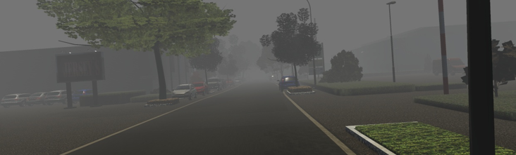

# Marigold Depth Replica

A PyTorch Lightning implementation of diffusion-based **monocular relative-depth estimation**, inspired by Marigold. The model adapts the Stable Diffusion 2 base latent diffusion backbone to predict depth from a single RGB image.

> **Project status:** research / learning implementation. This repository demonstrates the training and denoising pipeline; it is not an official Marigold release and does not claim metric parity with the original method.

## Result

The example below shows the RGB input alongside the model's predicted depth visualization. Bright and dark regions represent relative scene structure after visualization; the output is not calibrated to metric distance.

<p align="center">
  
  
</p>

<p align="center"><em>Left: input image. Right: predicted relative depth.</em></p>

## Approach

The implementation reuses pretrained components from `stabilityai/stable-diffusion-2-base` and trains a depth-conditioned denoiser:

1. The frozen Stable Diffusion VAE encodes the RGB image and normalized depth target into 4-channel latent tensors.
2. Gaussian noise is added to the depth latent at a randomly sampled diffusion timestep.
3. The noisy depth latent and image latent are concatenated, producing an 8-channel input to a modified U-Net.
4. The U-Net learns to predict the injected noise using mean-squared error.
5. At inference time, DDIM iteratively denoises an initially random depth latent. The VAE decodes it to a single-channel relative-depth map.

The first U-Net convolution is expanded from four to eight input channels. Its weights are initialized by duplicating the original Stable Diffusion input weights and scaling them by 0.5.

## Repository layout

```text
marigold/                 Model components
  marigoldDepth.py        Lightning module, training loss, and DDIM inference
  modifiedUnet.py         8-channel Stable Diffusion U-Net adaptation
  latentEncoder.py        Frozen VAE image/depth encoder
  latentDecoder.py        Frozen VAE decoder
  noise.py                DDIM scheduler wrapper
dataset/
  kttiDepthData.py        CSV-backed Virtual KITTI data module
src/trainer.py            Training entry point
tests/                    Component and forward-pass tests
```

## Setup

### 1. Clone and create an environment

```bash
git clone https://github.com/siddartha00/marigoldDepthReplica.git
cd marigoldDepthReplica
python -m venv .venv
```

Activate the environment using your platform's usual command, then install dependencies:

```bash
pip install -r requirements.txt
```

The pinned requirements target a CUDA-enabled PyTorch installation. Ensure the installed PyTorch build matches your NVIDIA driver and CUDA environment before training. A CUDA-capable GPU is expected by the supplied training script.

### 2. Make the Stable Diffusion base model available

By default, model components load `stabilityai/stable-diffusion-2-base` through Hugging Face Diffusers. The first run may download the VAE, U-Net, and scheduler weights. If Hugging Face access requires authentication or accepting a model license, complete that step before running the code.

## Dataset preparation

The data module expects Virtual KITTI-style RGB/depth pairs under:

```text
data/virtual_kitti_2/
  splits/
    train.csv
    val.csv
    test.csv
```

Each CSV must contain the columns below. Paths are resolved relative to the repository root.

```csv
rgb_file,depth_file
data/virtual_kitti_2/rgb/example.png,data/virtual_kitti_2/depth/example.png
```

During loading, RGB images are resized to 512 × 512 and normalized to `[-1, 1]`. Depth maps are independently scaled with their 2nd and 98th percentiles, then replicated to three channels for VAE encoding. This means the training target is **relative depth**, not absolute metric depth.

## Training

Run the default GPU training configuration from the repository root:

```bash
python src/trainer.py
```

Common options:

```bash
python src/trainer.py \
  --batch_size 4 \
  --num_workers 12 \
  --learning_rate 3e-5 \
  --max_epochs 10 \
  --precision 16-mixed
```

Checkpoints are written to `checkpoints/`, and CSV logs to `logs/marigold_depth/`. To continue a run:

```bash
python src/trainer.py --resume_from checkpoints/last.ckpt
```

The supplied trainer intentionally limits each epoch to 15% of training batches and 50% of validation batches. Remove or adjust `limit_train_batches` and `limit_val_batches` in `src/trainer.py` for a full training run.

## Inference

`MarigoldDepth.predict_depth()` accepts an image batch shaped `(B, 3, H, W)` in the `[-1, 1]` range and returns a `(B, 1, H, W)` relative-depth tensor. A checkpoint must be trained or provided first.

```python
import torch
from PIL import Image
from torchvision import transforms

from marigold.marigoldDepth import MarigoldDepth

model = MarigoldDepth.load_from_checkpoint("checkpoints/last.ckpt")
model.eval().cuda()

rgb = Image.open("input.png").convert("RGB")
to_tensor = transforms.Compose([
    transforms.Resize((512, 512)),
    transforms.ToTensor(),
])
image = (to_tensor(rgb) * 2.0 - 1.0).unsqueeze(0).cuda()

with torch.no_grad():
    depth = model.predict_depth(
        image,
        num_inference_steps=50,
        ensemble_size=10,
    )
```

Higher `num_inference_steps` and `ensemble_size` can improve stability, at the cost of slower inference. Because the model starts from random noise and the encoder samples latents by default, predictions can vary between runs.

## Limitations

- Outputs are relative depth maps and should not be interpreted as calibrated distances.
- The implementation resizes all inputs to 512 × 512, which can distort the original aspect ratio.
- The VAE is frozen, while the modified U-Net is the trainable component.
- No pre-trained checkpoint or benchmark metrics are included in this repository.

## License

This project is distributed under the [Apache License 2.0](LICENSE.txt). The Stable Diffusion base model and any dataset used with this project are subject to their own terms and licenses.

## Assets for this README

Before committing this README to the repository, place the two demonstration files at the repository root with these exact names:

- `orig-_in.png` — input image
- `depth_out.png` — predicted depth visualization
